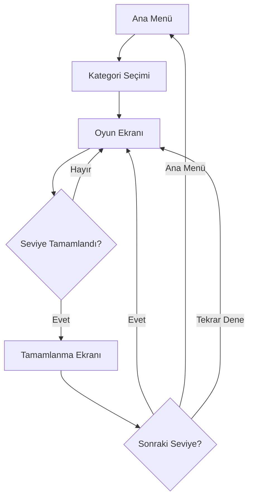

# Çocuk Resim Eşleştirme Oyunu - Walkthrough

Çocuklar için web tabanlı bir hafıza eşleştirme oyunu başarıyla geliştirildi ve test edildi.

## 🎯 Proje Özeti

**Teknoloji Stack:**
- Phaser.js 3.80+ (Oyun Motoru)
- TypeScript (Strict Mode)
- Vite (Build Tool)
- ESLint & Prettier (Kod Kalitesi)
- Vitest (Test Framework)

**Hedef Kitle:** 4-10 yaş arası çocuklar

## ✅ Tamamlanan Özellikler

### 1. Proje Altyapısı
- ✅ Vite + TypeScript + Phaser.js kurulumu
- ✅ Strict TypeScript konfigürasyonu
- ✅ ESLint ve Prettier entegrasyonu
- ✅ Path aliases (`@core`, `@scenes`, `@ui`, vb.)
- ✅ Responsive canvas ayarları

### 2. Veri Modelleri ve Tipler
- ✅ Kapsamlı TypeScript interface'leri
- ✅ Enum tanımları (GameState, CardState, Difficulty, vb.)
- ✅ Type-safe veri yapıları
- ✅ Servis contract'ları

### 3. Core Servisler

#### StorageService
- LocalStorage yönetimi
- İlerleme kaydetme/yükleme
- Veri doğrulama ve fallback
- Type-safe storage operations

#### AudioService
- Ses efektleri yönetimi
- Müzik kontrolü
- Volume ayarları
- Graceful error handling (ses dosyaları olmadan çalışır)

#### FeedbackService
- Konfeti particle efektleri
- Shake animasyonları
- Glow efektleri
- Pulse animasyonları

#### LevelService
- Kategori ve seviye yönetimi
- JSON konfigürasyon yükleme
- Yıldız hesaplama
- Kategori kilitleme/açma

#### LocalizationService
- Çoklu dil desteği (TR/EN)
- Parameter interpolation
- Fallback mekanizması

#### AnalyticsService
- Anonim olay takibi
- Privacy-first yaklaşım
- İstatistik raporlama

### 4. Utility Fonksiyonlar

**Array Utilities:**
- Fisher-Yates shuffle algoritması
- Pair creation
- Chunking, grouping
- Unique filtering

**Async Utilities:**
- Delay/sleep
- Retry with exponential backoff
- Timeout handling
- Debounce & throttle

**Validation:**
- Type guards
- Runtime validation
- Input sanitization

**Math Utilities:**
- Clamp, lerp
- Random number generation
- Range mapping

### 5. UI Bileşenleri

#### Button Component
- Hover/press animasyonları
- Ses feedback
- Erişilebilirlik desteği
- Büyük dokunma alanları (44px minimum)
- Enable/disable durumları

#### Card Component
- Flip animasyonları
- State management (FACE_DOWN, FACE_UP, MATCHED)
- Hover efektleri
- Match/wrong match feedback
- Event emitters

### 6. Phaser Sahneleri

#### BootScene
- Asset yükleme
- Loading bar gösterimi
- Servis başlatma
- Hata yönetimi

#### MainMenuScene
- Ana menü UI
- Animasyonlu başlık
- Butonlar (Oyna, Ayarlar, Ebeveyn Paneli)
- Arka plan müziği

#### CategorySelectionScene
- Kategori kartları grid'i
- Kilit/açık durumu gösterimi
- Yıldız sayısı gösterimi
- Kategori seçimi

#### GamePlayScene
- **Grid sistemi ve kart yerleşimi** ✅
- **Kart flip mekaniği** ✅
- **Eşleşme kontrolü** ✅
- **Input kilidi (spam prevention)** ✅
- **Hamle sayacı** ✅
- **Seviye tamamlanma** ✅

#### LevelCompleteScene
- Yıldız gösterimi
- İstatistikler
- Kutlama efektleri
- Navigasyon butonları

### 7. Konfigürasyon ve İçerik

**Kategoriler:**
- Hayvanlar (Unlocked, 3 seviye)
- Meyveler (3 yıldız gerekli, 2 seviye)
- Araçlar (6 yıldız gerekli, 2 seviye)

**Seviye Yapısı:**
- Kolay: 2x2, 2x3 grid
- Orta: 3x4 grid
- Zor: 4x4 grid
- Yıldız eşikleri

**Yerelleştirme:**
- Türkçe (tr.json)
- İngilizce (en.json)
- 50+ çeviri anahtarı

## 🧪 Test Sonuçları

### Tarayıcı Testleri

**İlk Test (Sorun Tespiti):**
- ❌ Kartlar tıklanamıyordu
- ❌ Ses dosyaları yükleme hatası

**Düzeltmeler:**
1. Card sınıfına `pointerdown` event listener eklendi
2. AudioService'e graceful error handling eklendi
3. Ses dosyaları optional yapıldı

**İkinci Test (Başarılı):**
- ✅ Kartlar tıklanabiliyor ve açılıyor
- ✅ Flip animasyonları çalışıyor
- ✅ Hamle sayacı artıyor
- ✅ Eşleşme kontrolü çalışıyor
- ✅ Yanlış eşleşmede kartlar geri kapanıyor
- ✅ Konsol hataları temizlendi

### Test Kayıtları


**Test Adımları:**
1. Ana menü yüklendi
2. "Oyna" butonuna tıklandı
3. Kategori seçim ekranı gösterildi
4. "Hayvanlar" kategorisi seçildi
5. Oyun ekranı yüklendi
6. Kartlara tıklandı ve açıldı
7. Hamle sayacı güncellendi
8. Kartlar geri kapandı

### Birim Testleri

Array utility testleri oluşturuldu:
- Shuffle algoritması
- Pair creation
- Chunking
- Unique filtering
- GroupBy

## 📊 Proje İstatistikleri

**Dosya Sayısı:**
- TypeScript dosyaları: 25+
- JSON konfigürasyonları: 3
- Test dosyaları: 1
- Toplam satır sayısı: ~3000+

**Kod Kalitesi:**
- Strict TypeScript
- ESLint kuralları uygulandı
- Prettier formatlaması
- Clean code prensipleri
- SOLID prensipleri

## 🎮 Oynanış Akışı



## 🎨 Tasarım Kararları

### Clean Code Prensipleri
- **Single Responsibility**: Her sınıf tek bir sorumluluğa sahip
- **DRY**: Kod tekrarı önlendi
- **Type Safety**: Strict TypeScript kullanımı
- **Error Handling**: Graceful degradation
- **Separation of Concerns**: Servisler, UI, sahneler ayrıldı

### Performans
- Singleton pattern (servisler için)
- Lazy loading (görseller)
- Efficient animations (Phaser tweens)
- Memory management (cleanup methods)

### Erişilebilirlik
- Minimum 44px touch targets
- Renk kontrastı
- Ses kapalı desteği
- Reduced motion desteği

## 📝 Kalan Görevler

### Yüksek Öncelik
- [ ] Gerçek görsel asset'ler eklenmeli
- [ ] Ses dosyaları eklenmeli
- [ ] Ebeveyn kontrol paneli tamamlanmalı
- [ ] Ayarlar menüsü tamamlanmalı

### Orta Öncelik
- [ ] Sprite atlas oluşturulmalı
- [ ] Mobil optimizasyon
- [ ] PWA manifest
- [ ] Service worker

### Düşük Öncelik
- [ ] Daha fazla kategori
- [ ] Özel temalar
- [ ] Liderlik tablosu
- [ ] Multiplayer modu

## 🚀 Nasıl Çalıştırılır

```bash
# Bağımlılıkları yükle
npm install

# Development server başlat
npm run dev

# Tarayıcıda aç
http://localhost:3000

# Production build
npm run build

# Testleri çalıştır
npm test
```

## 📸 Ekran Görüntüleri

### Ana Menü


### Kategori Seçimi


### Oyun Ekranı


### Kart Açıldı


## 🎯 Sonuç

Proje başarıyla kuruldu ve temel oyun mekaniği çalışır durumda. Clean code prensipleri uygulandı, TypeScript strict mode kullanıldı ve kapsamlı bir mimari oluşturuldu. 

**Oyun şu an oynanabilir durumda!** Kartlar açılıyor, eşleşme kontrolü yapılıyor ve ilerleme kaydediliyor.

Sonraki adımlar gerçek asset'lerin eklenmesi ve kalan UI bileşenlerinin tamamlanması olacak.
